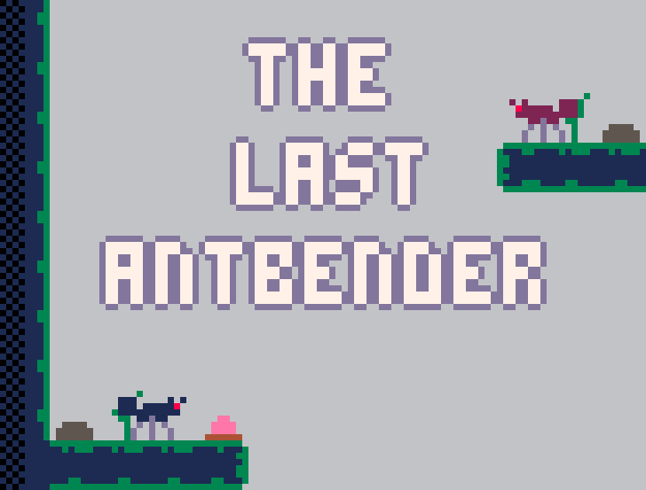
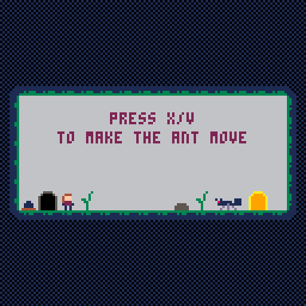
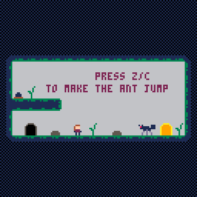

# The Last Antbender

This third little PICO-8 game was created for the Weekly Game Jam - Week 255.

## About the game:

Here you control Aela, the last Antbender and her ants. But beware, these are deadly. Dodge the ants and steer your way to the goal.

 

I wish you a lot of fun!

Play it now on [itch.io](https://peanutsfly.itch.io/the-last-antbender) or the [Lexaloffle Forum](https://www.lexaloffle.com/bbs/?tid=48009).

The [PICO-8 Fantasy Console](https://www.lexaloffle.com/pico-8.php) is required to compile the game yourself.

## How to play:

-   Control Aela with the arrow keys.
-   Use Z/C to command jumping ants to jump.
-   With X/V you command ants to run.

For the best gaming experience, you should play the game in full screen (on the browser) or locally (see downloads) on the PC!

## Credits:

-   Music: Space by @gruber_music
-   Art, Programming, Sounds: Made by Peanutsfly

## Additional Information:

-   Status: Released
-   Platforms: Windows, macOS, Linux, HTML5
-   Author: PeanutsFly
-   Genre: Puzzle, Action
-   Made with PICO-8, Aseprite
-   Tags: 2D, Arcade, Casual, PICO-8, Pixel Art, Retro, Short, Singleplayer, Puzzle
-   Average session: A few minutes
-   Languages: English
-   Inputs: Keyboard
